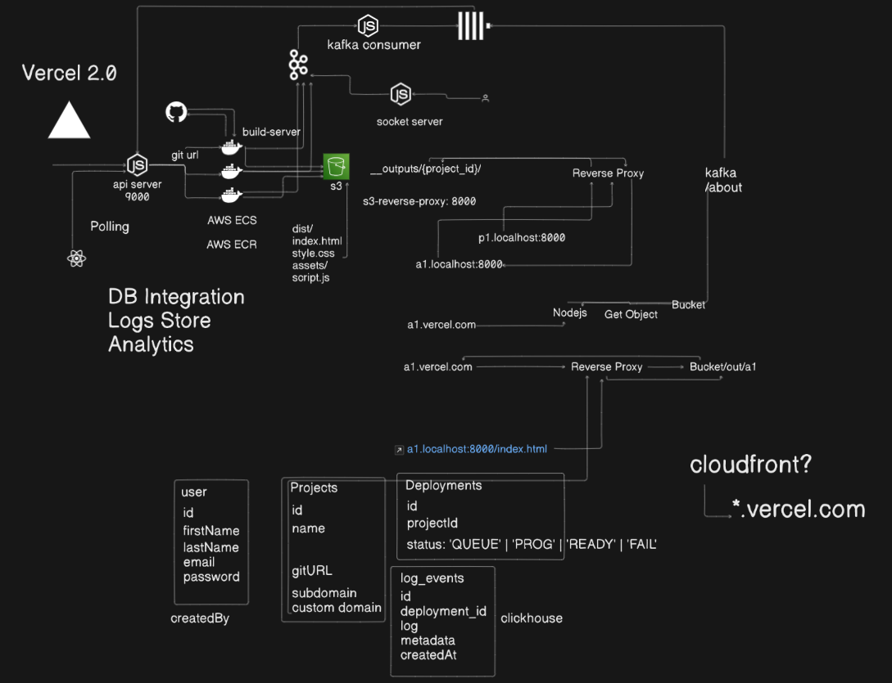

# Vercel Clone

## Setup Guide

This Project contains the following services and folders:

- **api-server**: HTTP API Server for REST API's
- **build-server**: Docker Image code which clones, builds, and pushes the build to S3
- **s3-reverse-proxy**: Reverse Proxy the subdomains and domains to S3 bucket static assets
- **frontend**: Next.js frontend for interaction with REST API

## Local Setup

1. Run `npm install` in all the 3 services, i.e., **api-server**, **build-server**, and **s3-reverse-proxy**.
2. Docker build the **build-server** and push the image to AWS ECR.
3. Set up the **api-server** by providing all the required config, such as TASK ARN and CLUSTER ARN.
4. Run `node index.js` in **api-server** and **s3-reverse-proxy**.
5. Run `npm run dev` in **frontend**

At this point, the following services would be up and running:

| S.No | Service             | PORT  |
|------|---------------------|-------|
| 1    | **api-server**      | :9000 |
| 2    | **socket.io-server**| :9002 |
| 3    | **s3-reverse-proxy**| :8000 |
| 3    | **frontend**        | :3000 |

## Demo
[Watch the Demo](https://s3.ap-south-1.amazonaws.com/vercel.clone.output/Demo.mp4)
## Architecture

